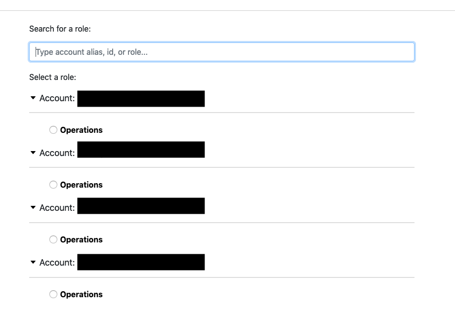
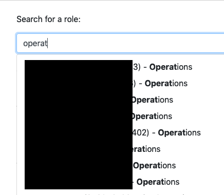

# aws-saml-search

Allows auto-complete searching of accounts/roles on the AWS SAML login form.

Implemented using [Web Extensions](https://developer.mozilla.org/en-US/docs/Mozilla/Add-ons/WebExtensions),
so this should work for both FireFox and Chrome (and probably others too)

## Screen Shots

## Installing

### Packaged Releases

These are signed releases in each browser's respective addon directory:

* [FireFox](https://addons.mozilla.org/en-US/firefox/addon/aws-saml-search/)
* [Chrome](https://chrome.google.com/webstore/detail/aws-saml-search/dgnkjmeflgibefhijajhbkcjepbpnlgp)

### Development

Use these instructions to run in development mode.

#### FireFox

* Clone this repo to your machine
* Navigate to [about:debugging](about:debugging)
* Click `Load Temporary Add-on`
* Select the manifest.json from the cloned repo

#### Chrome

* Clone this repo to your machine
* Navigate to [chrome://extensions/](chrome://extensions/)
* Enable Developer Mode
* Click `Load Unpacked"
* Select the cloned repo
